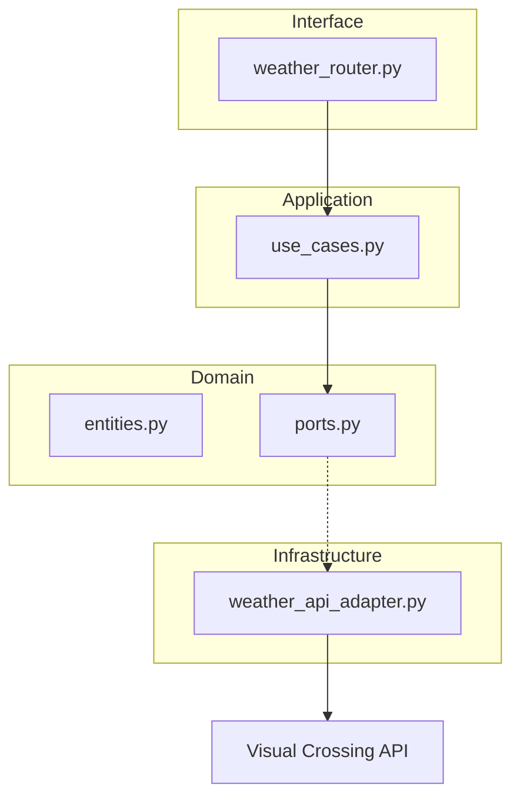

# 🌦️ Weather API Wrapper Service

Um serviço fullstack moderno para consulta de previsões meteorológicas, construído com foco em **Clean Code**, **Arquitetura Hexagonal** e **DDD (Domain-Driven Design)**.


## 🚀 Sobre o Projeto
Este projeto foi desenvolvido como parte do desafio oficial do **roadmap.sh**. 
**Link do projeto:** [https://roadmap.sh/projects/weather-api-wrapper-service](https://roadmap.sh/projects/weather-api-wrapper-service)

O objetivo é construir uma API que consome um serviço de clima de terceiros (Visual Crossing) e fornece uma interface limpa e performática para o usuário final.

---

## 🏗️ Arquitetura do Sistema

O backend foi estruturado utilizando **Arquitetura Hexagonal (Ports & Adapters)** para garantir que a lógica de negócio seja independente de tecnologias externas.



---

## ✨ Funcionalidades

### 🎨 Frontend (React + TypeScript)
- **Interface Premium**: Design inspirado no Dribbble com efeitos de Glassmorphism.
- **Animações Dinâmicas**: Ícones de clima animados via SVG e CSS Keyframes.
- **Responsividade**: Layout adaptável para desktop e dispositivos móveis.

### ⚙️ Backend (FastAPI + Python)
- **Injeção de Dependência**: desacoplamento total entre camadas.
- **Validação Estrita**: Uso de Pydantic para garantir integridade dos dados.
- **Documentação Automática**: Integrada via Swagger UI em `/docs`.

---

## 🛠️ Como Executar

### 1. Clonar o Repositório
```bash
git clone https://github.com/Matheus904-12/WeatherAPI.git
cd WeatherAPI
```

### 2. Configurar o Backend
```bash
cd backend
python -m venv venv
source venv/bin/activate  # Linux/Mac
# venv\Scripts\activate   # Windows
pip install -r requirements.txt
```
Crie um arquivo `.env` na pasta `backend/`:
```env
WEATHER_API_KEY=sua_chave_aqui
WEATHER_API_BASE_URL=https://weather.visualcrossing.com/VisualCrossingWebServices/rest/services/timeline
```
Inicie o servidor: `uvicorn main:app --reload`

### 3. Configurar o Frontend
```bash
cd ../frontend
npm install
npm run dev
```

---

## 📅 Roadmap de Evolução
- [x] Fase 1: Interface UI/UX Animada.
- [x] Fase 2: Estrutura Core do Backend.
- [ ] Fase 3: Cache de 12h com Redis.
- [ ] Fase 4: Histórico de Buscas com MongoDB.
- [ ] Fase 5: Integração Final e Deploy.
