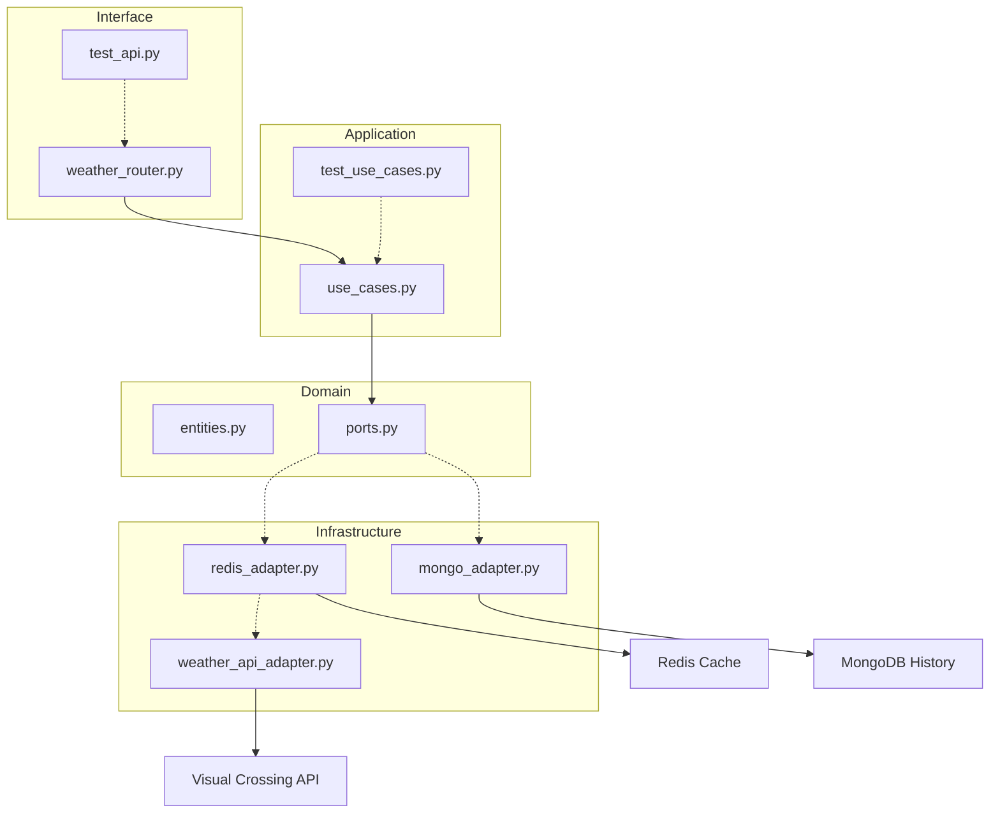

# 🌦️ Weather API Wrapper Service

Um serviço fullstack moderno para consulta de previsões meteorológicas, construído com foco em **Clean Code**, **Arquitetura Hexagonal**, **DDD** e **Qualidade de Software**.


## 🚀 Sobre o Projeto
Este projeto foi desenvolvido como parte do desafio oficial do **roadmap.sh**. 
O foco atual é a robustez do backend e a automação de testes.

---

## 🏗️ Arquitetura do Sistema

O backend utiliza **Arquitetura Hexagonal** para desacoplar a lógica de negócio das tecnologias externas.



---

## ✨ Funcionalidades e Qualidade

### 🧪 Testes e Automação (Novo!)
- **Testes Unitários**: Cobertura total da lógica de negócio no `GetWeatherUseCase`.
- **Mocks & Dublês**: Uso de `pytest-mock` para simular APIs e Bancos de Dados.
- **Testes de Integração**: Validação de endpoints FastAPI via `TestClient`.
- **Pipeline CI/CD**: Automação via GitHub Actions para garantir que nenhum commit quebre o sistema.

### ⚙️ Backend (FastAPI + Python)
- **Persistência com MongoDB**: Histórico permanente de todas as buscas.
- **Cache com Redis**: Otimização de performance de 12h.
- **Resiliência**: Tratamento de falhas de banco (Best Effort).

---

## 🛠️ Como Executar

### 1. Iniciar Infraestrutura (Docker)
```bash
docker compose up -d
```

### 2. Configurar o Backend
```bash
cd backend
python -m venv venv
source venv/bin/activate
pip install -r requirements.txt
pytest # Rodar os testes locais
```

### 3. Configurar o Frontend
```bash
cd ../frontend
npm install
npm run dev
```

---

## 📅 Roadmap de Evolução
- [x] Fase 1: Interface UI/UX Animada.
- [x] Fase 2: Estrutura Core do Backend.
- [x] Fase 3: Cache de 12h com Redis.
- [x] Fase 4: Histórico de Buscas com MongoDB.
- [x] Fase 5: Qualidade & Automação (Testes & CI). ✅
- [ ] Fase 6: Observabilidade & Debugging Masterclass.
- [ ] Fase 7: Deploy na Azure.
- [ ] Fase 8: Refatoração UI com Ionic Framework.

---
Desenvolvido por **Matheus** como parte do aprendizado avançado em Python, DDD e Clean Code.
