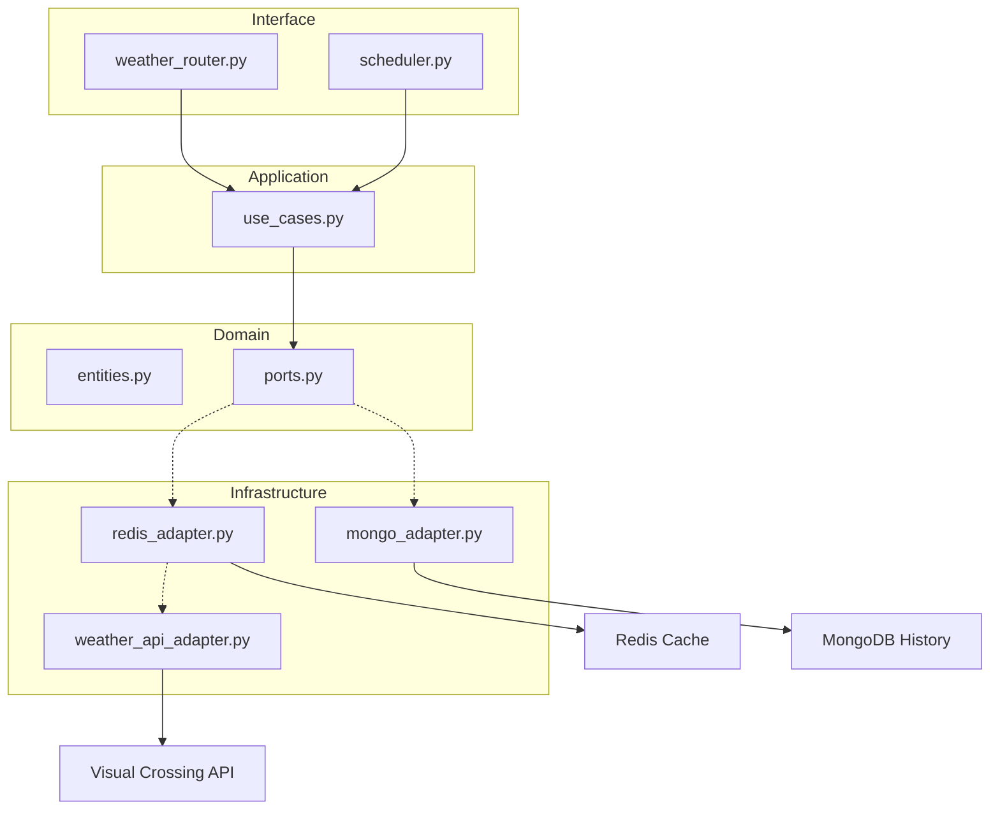

# 🌦️ Weather API Wrapper Service

Um serviço fullstack moderno para consulta de previsões meteorológicas, construído com foco em **Clean Code**, **Arquitetura Hexagonal**, **DDD** e **Qualidade de Software**.


## 🚀 Sobre o Projeto
Este projeto evoluiu de um simples wrapper para um **Coletor de Dados Automático**. Ele monitora cidades estratégicas e mantém um histórico persistente e cacheado para alta performance.

---

## 🏗️ Arquitetura do Sistema

O backend utiliza **Arquitetura Hexagonal** e um agendador de tarefas em segundo plano.



---

## ✨ Funcionalidades em Destaque

### 🤖 Robô Coletor (Background Harvester) - **NOVO!**
- **Agendamento Inteligente**: O sistema utiliza `APScheduler` para buscar o clima de cidades pré-definidas (ex: SP, Londres, NY, Tóquio) a cada 60 minutos.
- **Cache Warming**: O robô mantém o cache do Redis sempre "quente", garantindo resposta instantânea para buscas populares.
- **Persistência Automática**: Todas as coletas são salvas automaticamente no MongoDB.

### 🧪 Qualidade de Software
- **Testes Unitários & Integração**: 100% validado via `pytest`.
- **Pipeline CI/CD**: Garantia de integridade automática no GitHub Actions.

---

## 🛠️ Como Executar

### 1. Iniciar Infraestrutura (Docker)
```bash
docker compose up -d
```

### 2. Configurar o Backend
```bash
cd backend
python -m venv venv
source venv/bin/activate
pip install -r requirements.txt
python -m uvicorn main:app --reload
```

---

## 📅 Roadmap de Evolução
- [x] Fase 4: Histórico de Buscas com MongoDB.
- [x] Fase 5: Qualidade & Automação (Testes & CI).
- [x] Bônus: Robô Coletor de Dados (Cronjob). ✅
- [ ] Fase 6: Observabilidade & Debugging Masterclass.
- [ ] Fase 7: Deploy na Azure.
- [ ] Fase 8: Refatoração UI com Ionic Framework.

---
Desenvolvido por **Matheus** como parte do aprendizado avançado em Python, DDD e Clean Code.
